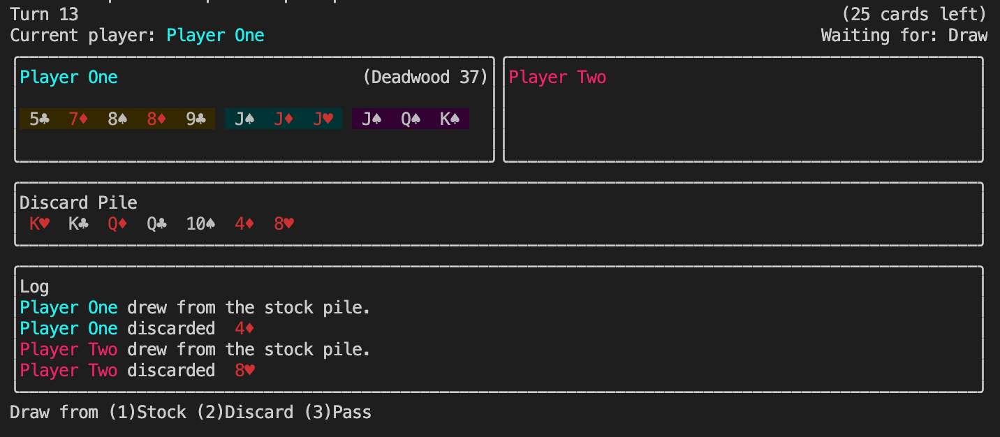

# gin-rummy

A CLI game of gin-rummy using [Ink](https://github.com/vadimdemedes/ink).

**Note:** This game is not complete. With some rules not yet implemented, and some interaction being less than refined. Hopefully it acts as a demonstration of Ink, interactive CLI applications, or just as a bit of fun.

### Getting Started

To start a game simply run

```bash
npx gin-rummy
```


